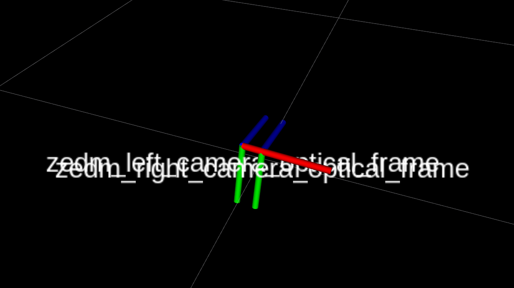
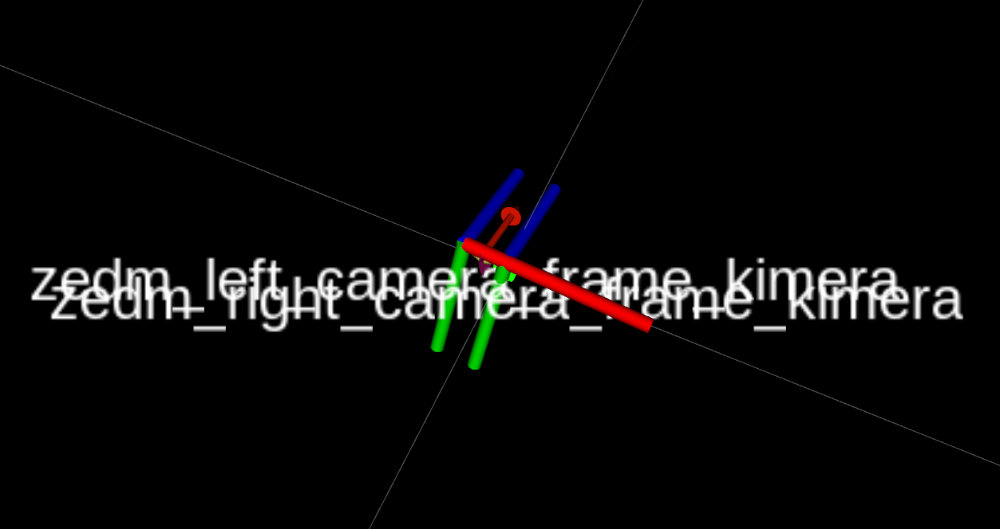

# Kimera-VIO-ROS

ROS Wrapper for [Kimera](https://github.com/MIT-SPARK/Kimera).

<div align="center">
    
</div>

# 1. Installation

## A. Prerequisities

- Install ROS by following [our reference](./docs/ros_installation.md), or the official [ROS website](https://www.ros.org/install/).

- ROS non-default dependencies for [mesh_rviz_plugins](https://github.com/MIT-SPARK/mesh_rviz_plugins) (change `noetic` for your ROS distribution):
```bash
sudo apt-get install ros-noetic-image-geometry ros-noetic-pcl-ros ros-noetic-cv-bridge
```

- System dependencies:
First, update package list: `sudo apt-get update`
```bash
# For 20.04 (noetic)
sudo apt-get install -y --no-install-recommends apt-utils
sudo apt-get install -y \
      cmake build-essential unzip pkg-config autoconf \
      libboost-all-dev \
      libjpeg-dev libpng-dev libtiff-dev \
      libvtk7-dev libgtk-3-dev \
      libatlas-base-dev gfortran \
      libparmetis-dev \
      python3-wstool python3-catkin-tools \
```

- GTSAM's Optional dependencies (highly recommended for speed)
Install [Intel Threaded Building Blocks (TBB)](http://www.threadingbuildingblocks.org/): `sudo apt-get install libtbb-dev`

## B. KimeraVIO ROS wrapper Installation
Kimera-VIO should use system Eigen (Eigen 3.3.7) and GTSAM-4.1 or 4.0. For forcing it to use system Eigen, we have to add an extra flag `DGTSAM_USE_SYSTEM_EIGEN=ON`. For GTSAM-4.1, you have to change the version inside `kimera_vio_ros_ssh.rosinstall` or `kimera_vio_ros_https.rosinstall` file.
```bash
source /opt/ros/noetic/setup.bash
mkdir -p ~/kimera_vio_ws/src
cd ~/kimera_vio_ws/
catkin init
catkin config -a --cmake-args -DGTSAM_USE_SYSTEM_EIGEN=ON -DCMAKE_BUILD_TYPE=RelWithDebInfo -DGTSAM_TANGENT_PREINTEGRATION=OFF -DGTSAM_BUILD_WITH_MARCH_NATIVE=OFF -DOPENGV_BUILD_WITH_MARCH_NATIVE=OFF
catkin config --merge-devel

# Clone the repo
cd ~/kimera_vio_ws/src
git clone git@github.com:ArghyaChatterjee/Kimera-VIO-ROS.git

# Install dependencies from rosinstall file using wstool
wstool init # Use unless wstool is already initialized
wstool merge Kimera-VIO-ROS/install/kimera_vio_ros_ssh.rosinstall

# download and update repos:
wstool update

# Optionally install all dependencies that you might have missed:
# Some packages may report errors, this is expected
# rosdep install --from-paths . --ignore-src -r -y
```

Finally, compile:

```bash
# Compile code
catkin build

# Refresh workspace
source ~/kimera_vio_ws/devel/setup.bash
```

# 2. Usage
## Work with ZED Data
Kimera VIO works with monocular images since the feature tracker (GFTT) works well with monocular images. So, you have to feed the monocular image data with IMU to kimera vio pipeline. Also, you have to change couple of parameters inside kimera-vio package. 

Inside `RightCameraParams.yaml`, use the extrinsics like this:
```
# Sensor extrinsics wrt. the body-frame.
T_BS:
  cols: 4
  rows: 4
  data: [ 0.0,  0.0, 1.0,  0.0,
         -1.0,  0.0, 0.0, -0.03,
          0.0, -1.0, 0.0,  0.013,
          0.0,  0.0, 0.0,  1.0]
```
Inside `LeftCameraParams.yaml`, use the extrinsics like this:
```
# Sensor extrinsics wrt. the body-frame.
T_BS:
  cols: 4
  rows: 4
  data: [ 0.0,  0.0, 1.0, 0.0,
         -1.0,  0.0, 0.0, 0.03,
          0.0, -1.0, 0.0, 0.013,
          0.0,  0.0, 0.0, 1.0]
```
This matches the orientation of the left and right frames from kimera vio package in the name of `zedm_left_camera_frame_kimera` and `zedm_right_camera_frame_kimera` with the default optical frame of zed-mini in the name of `zedm_left_camera_optical_frame` and `zedm_right_camera_optical_frame`. 

<div align="center">
    
    
</div>

Download a zed dataset from [[here]]() which has both stereo rgb and monocular image.

### Online
  1. In the first terminal, launch zed camera:
  ```bash
  roslaunch zed_wrapper zedm.launch
  ```
  2. In another terminal, you have to run the imu transform package to transform imu data to `base_link` frame from `zedm_imu_link` frame.
  ```bash
  roslaunch tf_imu_to_base zedm_imu_transform.launch
  ```
  This node will subscribe to `/zedm/zed_node/imu/data` topic and publish to `/zedm/zed_node/imu/data_transformed` topic.

  3. In another terminal, you have to launch the Kimera-VIO ROS wrapper. You have the following options to provide from a zed camera:
  ```
    <!-- Subscriber Topics -->
  <arg name="left_cam_topic"        default="/$(arg robot_name)/zed_node/left/image_rect_gray"/>
  <arg name="right_cam_topic"       default="/$(arg robot_name)/zed_node/right/image_rect_gray"/>
  <arg name="imu_topic"             default="/$(arg robot_name)/zed_node/imu/data_transformed"/>
  <arg name="external_odom_topic"   default="/$(arg robot_name)/zed_node/odom"/>
  ```
  You can set the robot_name as `zedm` for zed mini and `zed2` for zed2 cameras.
  
  Launch KimeraVIO ROS wrapper without loop closure module:
  ```bash
  roslaunch kimera_vio_ros kimera_vio_ros_zedm.launch online:=true viz_type:=1 use_lcd:=false
  ```
  Inside `kimera_vio_ros_zedm.launch`, make `use_sim_time` parameter to `false` to use system clock.
  ```
  <arg name="use_sim_time"      default="false"/>
  ```
  Optional: If you want to use Kimera VIO with External Visual Loop Closures:
  ```bash
  roslaunch kimera_vio_ros kimera_vio_ros_zedm.launch online:=true viz_type:=1 use_lcd:=true lcd_no_optimize:=true
  ```
  To achieve the best results with Kimera-VIO, wait for the LCD vocabulary to finish loading before starting the camera.

  Also, if you want to use an external odometry source as assisting odom topic, inside the `kimera_vio_ros_zedm.launch` file, make `use_external_odom` parameter to `true` (default is `false`) and give a topic name to it. For us, this is:
  ```
  <arg name="external_odom_topic"   default="/$(arg robot_name)/zed_node/odom"/>
  ```

  4. In another terminal, launch rviz for visualization:
  ```bash
  rviz -d $(rospack find kimera_vio_ros)/rviz/kimera_vio_zedm.rviz
  ```
  > Note: this rviz configuration makes use of a rviz plugin: [mesh_rviz_plugins](https://github.com/MIT-SPARK/mesh_rviz_plugins). To visualize the textured 3D mesh, clone this plugin to your catkin workspace and catkin build it (note that this should be done automatically via `wstool`)

### Offline - rosbag
  1. As a general good practice, open a new terminal and run: `roscore`

  2. In another terminal, launch KimeraVIO ROS wrapper:
  ```bash
  roslaunch kimera_vio_ros kimera_vio_ros_zedm.launch online:=true viz_type:=1 use_lcd:=false
  ```
  Before launching, inside `kimera_vio_ros_zedm.launch`, make `use_sim_time` parameter to `true` to use the rosbag clock.
  ```
  <arg name="use_sim_time"      default="true"/>
  ```
  Optional: If you want to use Kimera VIO with External Visual Loop Closures (ORB SLAM):
  ```bash
  roslaunch kimera_vio_ros kimera_vio_ros_zedm.launch online:=true viz_type:=1 use_lcd:=true lcd_no_optimize:=true
  ```
  To achieve the best results with Kimera-VIO, wait for the LCD vocabulary to finish loading before starting the rosbag.

  3. In another terminal, launch rviz for visualization:
  ```bash
  rviz -d $(rospack find kimera_vio_ros)/rviz/kimera_vio_zedm.rviz
  ```
  > Note: this rviz configuration makes use of a rviz plugin: [mesh_rviz_plugins](https://github.com/MIT-SPARK/mesh_rviz_plugins). To visualize the textured 3D mesh, clone this plugin to your catkin workspace and catkin build it (note that this should be done automatically via `wstool`).

  4. Finally, in another terminal, launch the downloaded zed rosbag:
  ```bash
  rosbag play --clock /PATH/TO/ZED_ROSBAG
  ```

## Work with Euroc Data
Download a [Euroc](https://projects.asl.ethz.ch/datasets/doku.php?id=kmavvisualinertialdatasets) rosbag: for example [V1_01_easy](http://robotics.ethz.ch/~asl-datasets/ijrr_euroc_mav_dataset/vicon_room1/V1_01_easy/V1_01_easy.bag).

### Offline - rosbag
  1. As a general good practice, open a new terminal and run: `roscore`

  2. In another terminal, launch KimeraVIO ROS wrapper:
  ```bash
  roslaunch kimera_vio_ros kimera_vio_ros_euroc.launch
  ```

  3. In another terminal, launch rviz for visualization:
  ```bash
  rviz -d $(rospack find kimera_vio_ros)/rviz/kimera_vio_euroc.rviz
  ```
  > Note: this rviz configuration makes use of a rviz plugin: [mesh_rviz_plugins](https://github.com/MIT-SPARK/mesh_rviz_plugins). To visualize the textured 3D mesh, clone this plugin to your catkin workspace and catkin build it (note that this should be done automatically via `wstool`).

  4. Finally, in another terminal, launch the downloaded Euroc rosbag:
  ```bash
  rosbag play --clock /PATH/TO/EUROC_ROSBAG
  ```

  > Note that you will need to both source ROS and your `catkin_ws` for each new terminal unless you added the following lines to your `~/.bashrc` file:
  > ```bash
  > source /opt/ros/noetic/setup.bash  # Change `noetic` for your ROS distribution.
  > source ~/catkin_ws/devel/setup.bash # Change `bash` to the shell you use.
  > ```

### Offline
  In this mode, the provided rosbag will be first parsed and then sent to the VIO for processing.
  This is particularly useful when debugging to avoid potential ROS networking issues.
  - To run, launch the KimeraVIO ROS wrapper with the `online` parameter set to `false` and specify the rosbag's path:
  ```bash
  roslaunch kimera_vio_ros kimera_vio_ros_euroc.launch online:=false rosbag_path:="PATH/TO/ROSBAG"
  ```

### Running Unit tests

To run unit tests using catkin for this specific package, call (after building the package and sourcing the workspace):

```bash
catkin run_tests --no-deps --this
```

## Other functionalities

### Using camera_info topics instead of Yaml parameters

It is sometimes convenient to use the `camera_info` topics to parse the camera's parameters.
There is currently only one way to use these topics:
 - Offline: using the launch file `launch/cam_info_yamlizer.launch` which will generate yaml files out of the topics.
 You need to make sure that the `frame_id`s and the ROS topics are correctly set. Also, mind that the left/right cam frame ids are typically set as static tfs in a rosbag, therefore, first launch the node, and then run the rosbag (in case you see an exception bcs of a missing frame_id).

### Restart Kimera-VIO

The typical use case is that you have multiple rosbags and you don't want to be killing Kimera-VIO(-ROS) each time.
If this is your case, then we provide a rosservice to restart Kimera-VIO (it will do a hard restart, meaning the whole pipeline and data provider will be destructed and constructed again).
```bash
rosservice call /kimera_vio_ros/kimera_vio_ros_node/restart_kimera_vio
```
> Note that Kimera-VIO will complain if timestamps are not strictly increasing. Therefore, one must follow these steps:
> 1. Start Kimera-VIO and rosbag
> 2. Stop rosbag
> 3. Call rosservice to restart VIO
> 4. Start another rosbag

### Enable Dense Depth Stereo estimation

This will run OpenCV's StereoBM algorithm, more info can be found [here](http://wiki.ros.org/stereo_image_proc) (also checkout this to [choose good parameters](http://wiki.ros.org/stereo_image_proc/Tutorials/ChoosingGoodStereoParameters)):

```bash
roslaunch kimera_vio_ros kimera_vio_ros_euroc run_stereo_dense:=1
```

This will publish a `/stereo_gray/points2` topic, which you can visualize in Rviz as a 3D pointcloud.
Alternatively, if you want to visualize the depth image, since Rviz does not provide a plugin to
visualize a [disparity image](http://docs.ros.org/api/stereo_msgs/html/msg/DisparityImage.html), we also run a [disparity_image_proc](https://github.com/MIT-SPARK/disparity_image_proc) nodelet that will publish the depth image to `/stereo_gray/disparity_image_proc/depth/image_raw`.

# Hardware use

See the [documentation on hardware setup](docs/hardware_setup.md) for instructions on running KimeraROS on supported hardware platforms, as well as guides on how to develop for other platforms.

# BSD License
KimeraVIO ROS wrapper is open source under the BSD license, see the [LICENSE.BSD](./LICENSE.BSD) file.
